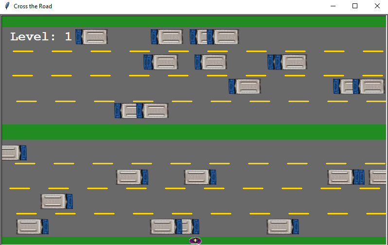

# 🛣️ Cross the Road Game

**Cross the Road** is a retro-inspired game where players navigate through a busy highway filled with fast-moving cars. The goal is to cross the road safely without colliding with any obstacles. This project was created using **Object-Oriented Programming (OOP)** principles to demonstrate modular and organized code structure, enhancing the gameplay experience.

---

## 🌟 Features
- 🎮 **Interactive gameplay**: Dodge oncoming cars as you move forward across multiple lanes.
- 🛤️ **Multiple lanes with alternating traffic directions**: Cars move in different directions on each lane, adding a realistic challenge.
- 🚀 **Dynamic level progression**: As you cross the highway, the level increases, speeding up the traffic.
- 🕹️ **Retro graphics and animations**: Simple graphics bring a nostalgic feel to the game.

---

## 📸 Screenshot
  
*(Replace `screenshots/image.png` with the actual path to your screenshot if different)*

---

## 🚀 Getting Started
Follow these steps to set up and run the game locally.

### ✅ Prerequisites
- **Python** (version 3.x)
- **Turtle Graphics** (comes pre-installed with Python)

### 🛠️ Installation
1. **Clone the repository**: `git clone https://github.com/RuginaAlex/RoadRusher.git`
2. **Navigate into the project directory**: `cd Turtle\ Crossing`
3. **Run the game**: `python main.py`

---

## 🎮 How to Play
1. **Objective**: Cross the road by avoiding the cars and reaching the finish line.
2. **Controls**:
   - ⬆️ `Up Arrow`: Move forward.
   - ⬇️ `Down Arrow`: Move backward.
3. **Gameplay**:
   - Wait for the "GO!" signal after the highway populates with cars.
   - Use the arrow keys to navigate and avoid obstacles.
   - Each successful crossing increases the level and the speed of traffic.

---

## 🛠️ Code Structure
This game was built using **Object-Oriented Programming (OOP)**, with each key element of the game represented as a separate class for modularity and scalability.
- **`Player` Class** (`player.py`): Controls player movement and position reset when leveling up.
- **`CarManager` Class** (`car_manager.py`): Manages car spawning, movement, and speed increment as levels progress.
- **`Scoreboard` Class** (`scoreboard.py`): Displays the level, game over message, and "GO!" start signal.
- **`BackgroundSetter` Class** (`background.py`): Creates and renders the road and grass lanes, as well as the striped lines for visual effect.

---

## 📜 Development History

This section provides a visual history of the project's development, showcasing how the game evolved over time.

### 1️⃣ Initial Prototype
In the initial version, the game had basic graphics and minimal functionality. Only the player and the background were implemented.

  
*Basic prototype with minimal graphics and basic movement.*

### 2️⃣ Adding Obstacles
The next stage introduced moving obstacles (cars) with simple rectangular shapes, which added an initial level of challenge.

  
*Obstacles were added, giving players a reason to avoid collisions.*

### 3️⃣ Improved Graphics and Level Progression
Graphics were improved by adding pixel-art vehicles and a "level-up" mechanic. Players now see their progress after each successful crossing.

  
*Improved visuals with pixel-art cars and a level-up system to increase difficulty.*

### 4️⃣ Final Version
The final version includes enhanced graphics, animations, score tracking, and a "GO!" signal to indicate when the game is ready to start.

  
*Final version with all features implemented: traffic, levels, animations, and scoring.*

---

## 📚 Key Concepts Demonstrated
- **Object-Oriented Programming (OOP)**: Implemented core classes (`Player`, `CarManager`, `Scoreboard`, `BackgroundSetter`) to organize and modularize code.
- **Encapsulation**: Each class encapsulates specific functionalities and properties, promoting clean code.
- **Inheritance**: Inherited from Turtle class to leverage the `Turtle` graphics library for easy visualization.

---

## 🤝 Contributions

Contributions are welcome! If you find a bug, have an idea for improvement, or want to use part of this code in your own project, please feel free to contact me or open an issue. 

If you use this code, a simple credit or mention would be greatly appreciated. Thank you for supporting open-source projects!

---

## 📜 License

This project is licensed under the MIT License - see the [LICENSE](LICENSE) file for details.
