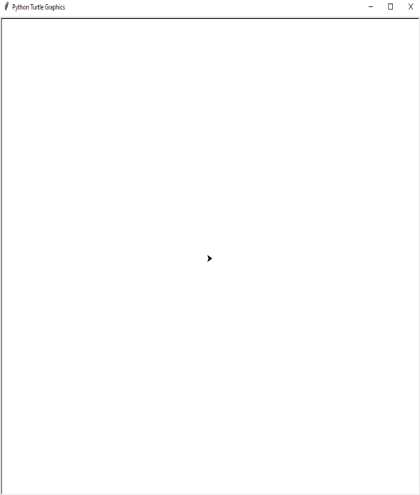

# 🛣️ Cross the Road Game

**Cross the Road** is a retro-inspired game where players navigate through a busy highway filled with fast-moving cars. The goal is to cross the road safely without colliding with any obstacles. This project was created using **Object-Oriented Programming (OOP)** principles to demonstrate modular and organized code structure, enhancing the gameplay experience.

---

## 🌟 Features
- 🎮 **Interactive gameplay**: Dodge oncoming cars as you move forward across multiple lanes.
- 🛤️ **Multiple lanes with alternating traffic directions**: Cars move in different directions on each lane, adding a realistic challenge.
- 🚀 **Dynamic level progression**: As you cross the highway, the level increases, speeding up the traffic.
- 🕹️ **Retro graphics and animations**: Simple graphics bring a nostalgic feel to the game.

---

## 📸 Screenshot
  
*(Replace `screenshots/image.png` with the actual path to your screenshot if different)*

---

## 🚀 Getting Started
Follow these steps to set up and run the game locally.

### ✅ Prerequisites
- **Python** (version 3.x)
- **Turtle Graphics** (comes pre-installed with Python)

### 🛠️ Installation
1. **Clone the repository**: `git clone https://github.com/RuginaAlex/RoadRusher.git`
2. **Navigate into the project directory**: `cd Turtle\ Crossing`
3. **Run the game**: `python main.py`

---

## 🎮 How to Play
1. **Objective**: Cross the road by avoiding the cars and reaching the finish line.
2. **Controls**:
   - ⬆️ `Up Arrow`: Move forward.
   - ⬇️ `Down Arrow`: Move backward.
3. **Gameplay**:
   - Wait for the "GO!" signal after the highway populates with cars.
   - Use the arrow keys to navigate and avoid obstacles.
   - Each successful crossing increases the level and the speed of traffic.

---

## 🛠️ Code Structure
This game was built using **Object-Oriented Programming (OOP)**, with each key element of the game represented as a separate class for modularity and scalability.
- **`Player` Class** (`player.py`): Controls player movement and position reset when leveling up.
- **`CarManager` Class** (`car_manager.py`): Manages car spawning, movement, and speed increment as levels progress.
- **`Scoreboard` Class** (`scoreboard.py`): Displays the level, game over message, and "GO!" start signal.
- **`BackgroundSetter` Class** (`background.py`): Creates and renders the road and grass lanes, as well as the striped lines for visual effect.

---

## 📜 Development History

This section provides a visual history of the project's development, showcasing how the game evolved over time.

### 1️⃣ The Beginning
Everything started with a simple Turtle object on an empty screen. The initial setup was basic—a single turtle icon displayed at the center of a blank, white screen. This small setup marked the start of what would become an interactive game, gradually growing into a multi-level, traffic-dodging adventure.

  
*The very first version: a single Turtle object on an empty canvas.*

### 2️⃣ Adding Obstacles
The next stage introduced moving obstacles (cars) with simple rectangular shapes, which added an initial level of challenge.

  
*Obstacles were added, giving players a reason to avoid collisions.*

### 3️⃣ Improved Graphics and Character Animation
At this stage, graphics were significantly improved. The cars were represented by pixel-art graphics inspired by **GTA 1**, and the main character was selected from **Hotline Miami**, adding a unique retro touch to the game. The character has two states:
   - **Alive**: The default state when crossing the road.
   - **Dead**: Two distinct animations that play when the character collides with a car.

  
*The player character when alive, ready to cross the road.*

  
  
*The player character with two distinct animations upon "death", adding a touch of realism and dynamic feedback.*

This stage also included a "level-up" mechanic, allowing players to experience increased difficulty as they progressed.

### 4️⃣ Road and Environment Creation
The road and environment were drawn programmatically using **Turtle Graphics**. Here’s a breakdown of how it was done:
   - **Grass Lanes**: Green rectangles were drawn at the top, middle, and bottom of the screen to represent safe zones where players can rest.
   - **Road Lanes**: Gray rectangles were drawn between the grass zones to serve as the road. This visual separation makes it clear where the danger zones are.
   - **Lane Stripes**: Yellow stripes were added along the road to separate lanes and mimic the look of a highway, enhancing the gameplay experience.

These elements were created using the `BackgroundSetter` class, which controlled the Turtle's movement to draw lines and stripes at specific locations on the screen. The Turtle’s `penup()` and `pendown()` methods were used to control when it draws and when it simply moves, allowing precise placement of each road element.

### 5️⃣ Final Version with Demo
The final version includes all features: enhanced graphics, animations, score tracking, and a "GO!" signal to indicate when the game is ready to start. Additionally, a demo video has been included below to showcase gameplay mechanics and graphics in action.

  
*Final version with all features implemented: traffic, levels, animations, and scoring.*

### 🎥 Demo Video
To see the game in action, watch this [demo video](link_to_demo_video).

---

## 📚 Key Concepts Demonstrated
- **Object-Oriented Programming (OOP)**: Implemented core classes (`Player`, `CarManager`, `Scoreboard`, `BackgroundSetter`) to organize and modularize code.
- **Encapsulation**: Each class encapsulates specific functionalities and properties, promoting clean code.
- **Inheritance**: Inherited from Turtle class to leverage the `Turtle` graphics library for easy visualization.

---

## 🤝 Contributions

Contributions are welcome! If you find a bug, have an idea for improvement, or want to use part of this code in your own project, please feel free to contact me or open an issue. 

If you use this code, a simple credit or mention would be greatly appreciated. Thank you for supporting open-source projects!

---

## 📜 License

This project is licensed under the MIT License - see the [LICENSE](LICENSE) file for details.
